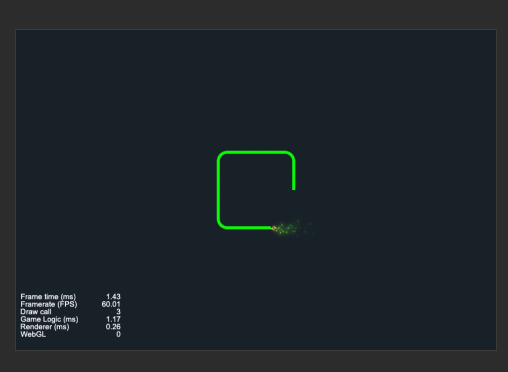
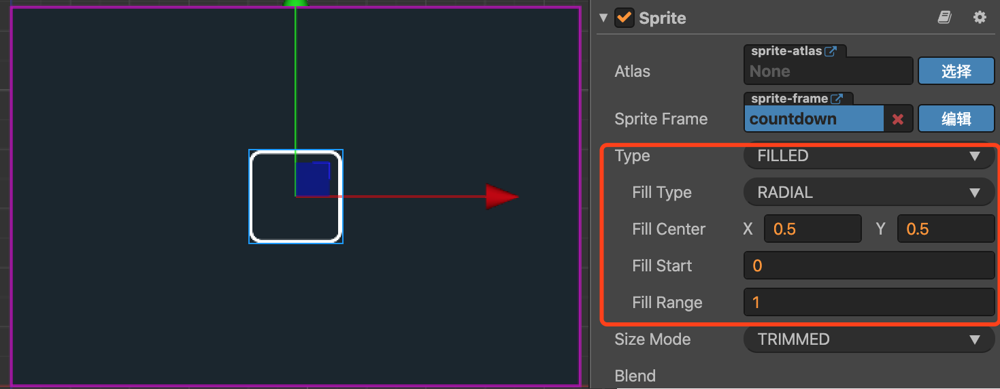
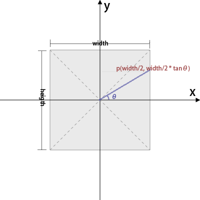
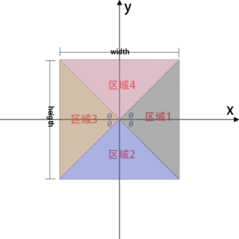

## Cocos Creator实用技巧：头像倒计时效果实现

技能CD、头像倒计时这类是游戏中经常出现的一类效果，而具体如何来实现？
本文将以头像倒计时为例来讲解说明。先上效果图：




### 一、实现方案

#### 1、倒计时进度

涉及倒计时，肯定需要考虑倒计时进度推进的表现。这里我们使用Sprite精灵组件。平时我们经常使用Sprite来显示图像，这里我们同样通过Sprite来显示头像框图片，
查看Sprite文档我们发现Sprite有一个渲染模式Type为填充类型（Filled），填充模式（Filled）支持RADIAL（扇形填充），正好可以满足我们想要的进度填充效果。而对于具体的进度值的控制我们则可以通过代码定时控制Fill Start、Fill Range等属性值的改变填充进度的表现。UI节点属性设置如下：



基于上述基本思路，具体逻辑实现我们需要解决两个问题：

**（1）进度计算**

其实进度计算到思路很简单，开始倒计时获取当前时间戳，定时更新过程中不断获取对应到时间断的时间戳，计算已经执行了的时长cur_step，然后与总时长all_step相比较计算已经填充的百分比，然后来设置Sprite的fillRange即可。

但这地方需要注意的一点是实际应用中考虑到断线重连等情况，可能需要对当前时长cur_step进行额外处理。这里就涉及到两个时间：总时间normal_sces、剩余时间wait_sces。根据两者之差即可计算出已经执行了到时长cur_step，然后在定时更新时基于该值去计算新到已执行时长即可。

**（2）定时更新**

提到定时更新，首先可能想到了开启一个定时器来不断刷新，虽然可以实现功能，但此处个人倾向于另外一个实现方式：重复的action动作，即将进度更新逻辑封装为一个回调函数，然后整合到cc.repeatForever中，通过头像精灵对象节点执行runAction来实现。

具体代码实现：
```
showCountdown()
{
    let wait_sces = 30 * 1000;      //剩余倒计时时间
    let normal_sces = 30 * 1000;    //总倒计时时间

    let bStartWithZero = (wait_sces == normal_sces) ? true : false;

    let timer = (new Date()).valueOf();
    let cur_step = bStartWithZero ? 0 : (normal_sces - wait_sces);
    let all_step = normal_sces;
    let cur_step_temp = cur_step;

    let ui_countdown_comp = this.ui_countdown.getComponent(cc.Sprite);
    ui_countdown_comp.node.color = cc.color(0, 255, 0);
    ui_countdown_comp.fillStart = 0;
    ui_countdown_comp.fillRange = 1 - (cur_step / all_step);

    // 更新逻辑
    let call_back = cc.callFunc(() => {
        cur_step = bStartWithZero ? (new Date()).valueOf() - timer : (cur_step_temp + (new Date()).valueOf() - timer);
        if (cur_step > all_step) {
            ui_countdown_comp.node.stopAllActions();
            this.ui_countdown.active = false;
            this.ui_countdown_particle.active = false;
            return;
        }
        let step_fillrange = cur_step / all_step;
        ui_countdown_comp.fillRange = 1 - step_fillrange;
    })

    // 动作执行
    let seq = cc.sequence(cc.delayTime(0.1), call_back);
    let repeater = cc.repeatForever(seq);
    ui_countdown_comp.node.active = true;
    ui_countdown_comp.node.runAction(repeater);
}
```

#### 2、颜色控制
在实际应用中，倒计时显示可能会想要达到推进过程中颜色渐变到效果。基于上述倒计时进度的实现，我们只需要在更新逻辑中去改变节点颜色即可。

根据更新进度获取对应的颜色，具体颜色获取代码如下：
```
getColorByFillRange(fill_range: number) :any
{
    let color = cc.Color.WHITE;
    if (fill_range < 0.33) {
        color = cc.Color.GREEN;
    } else if (fill_range < 0.66) {
        color = cc.Color.YELLOW;
    } else {
        color = cc.Color.RED;
    }
    return color;
}
```

上述颜色改变是根据0.33、0.66的进度分界点来划分设置颜色。如果想进一步达到渐变效果，可对颜色值进行计算.具体如下：
```
getColorByFillRange(fill_range: number) {
    let one = 500 / 60
    let r = 0
    let g = 0
    let b = 0

    if (fill_range < 0.33) {
        r = one * fill_range * 90
        g = 255
    } else if (fill_range < 0.66) {
        r = 255
        g = 255 - (fill_range * 90 - 30) * one
    } else {
        r = 255
    }
    return cc.color(r, g, b);
}
```

#### 3、尾巴特效
基于上述倒计时进度、颜色控制，我们基本已经实现了倒计时效果。我们为了达到更好对效果，这里考虑添加一个倒计时小尾巴特效。这里我们通过绑定一个粒子特效节点来实现（具体粒子特效如何制作这里暂时就不讲解了）。有了粒子特效，接下来我们需要考虑如何解决粒子特效进度跟随效果以及具体达到我们想要对效果。

倒计时填充是沿着头像框边框不断在推进，而粒子特效跟随移动对轨迹也就是头像边框上的一个个点，因为我们需要来计算对应进度时边框上对应位置，然后同步更新粒子特效节点对位置即可。

##### 1、粒子特效位置计算
我们知道在直角坐标系中，利用三角函数，我们根据长、宽、角度以及角对角线等关系，我们可以很轻松等计算得到边框上等坐标点。如下图所示：



而在我们等头像倒计时中，头像进度是RADIAL（扇形填充），会产生一个角度，而根据FillRange我们可以计算出该角度。根据角度、边框长宽，我们也就可以很容易等计算出进度对应边框上等坐标点，也就是粒子特效子节点在边框上对位置。

实际中节点位置涉及正、负值等问题，对应等我们自然需要考虑区域划分来计算。首先想到等可能就是直角坐标系象限划分这种方式，但仔细观察会发现象限划分方式随着进度推进，在某个象限内有时会将象限拆分为两种不同对图形，给计算会造成很大麻烦，因而我们不采取该划分方式。

我们引入对角线，发现对角线正好可以将矩形划分为四个三角形区域，而三角形对某一条边正好就是轨迹在该区域的路径，而且对角线构造的夹脚可以通过矩形框很容易计算。这种方式可以很好的进行区域划分计算。具体如下图所示：



这里我们可以前提确定几个已知量：
（1）. 头像框进度fillrange为‘fr’，进度走过的角度为a = PI * 2 * fr。
（2）. 对角线与x轴构成的夹脚，根据矩形长(H = height/2)、宽（W = width/2）可以计算A = Math.atan(H / W)

**区域-1**
角度a范围: a <= A || a >= PI*2 - A
边框坐标:
x = W
-W * tan(a)

**区域-2**
角度a范围: a > A && a >= PI - A
边框坐标:
x = H / tan(a)
y = -H

**区域-3**
角度a范围: a > PI-A && a <= PI + A
边框坐标:
x = -W
y = W * tan(a)

**区域-4**
角度a范围: a > PI+A && a <= PI*2 - A
边框坐标:
x = H / tan(a)
y = H

##### 2、自定义粒子效果
为了让粒子特效达到更好的表现效果，我们可以开启自定义粒子属性custom进行相关控制

##### 3、代码实现
```
refreshParticle(color:any)
{
    let particle: cc.ParticleSystem = this.ui_countdown_particle.getComponent(cc.ParticleSystem);
    particle.endColor = new cc.Color(color.getR(), color.getG(), color.getB(), 100);
    if (!this.ui_countdown_particle.active) {
        this.ui_countdown_particle.active = true
        this.particlePos = this.ui_countdown_particle.position;
        particle.resetSystem();
    }

    let ui_countdown_comp = this.ui_countdown.getComponent(cc.Sprite)

    let W = this.ui_countdown.width / 2 - 2
    let H = this.ui_countdown.height / 2 - 2
    let A = Math.atan(H / W)

    let x = 0;
    let y = 0;

    let PI = Math.PI;
    let cur_fill = 1 - ui_countdown_comp.fillRange;
    let a = PI * 2 * cur_fill;
    if (PI*2-A <= a || a <= A) {    
        x = W
        y = -W * Math.tan(a)
    }
    else if (A < a && a < PI - A) {
        x = H / Math.tan(a)  
        y = -H
    }
    else if (PI-A <= a && a <= PI+A) {
        x = -W
        y = W * Math.tan(a)
    }
    else if (PI+A < a && a < PI*2-A) {
        x = -H / Math.tan(a)    
        y = H
    }


    this.ui_countdown_particle.x = this.ui_countdown.x + x - 1
    this.ui_countdown_particle.y = this.ui_countdown.y + y

    //自定义粒子效果--根据坐标变化 改变重力
    particle.custom = true;
    let _gravityX = this.particlePos.x - this.ui_countdown_particle.x;
    let _gravityY = this.particlePos.y - this.ui_countdown_particle.y;
    this.particlePos = this.ui_countdown_particle.position;
    particle.gravity = cc.v2(_gravityX * 50, _gravityY * 50);
}
```

----
#### 二、总结

1、UI控件选择

本文例子中使用的是Sprite控件，使用的其填充类型的渲染模式来进行控制处理。实际上cocos creator中很多UI控件都有这一属性（例如ProgressBar），也都可以用来实现技能CD、头像倒计时等效果。使用方法也都大同小异。

2、扩展

本例中使用都是矩形框头像，如果换成圆形头像呢？实际上实现也很简单，同样利用数学知识，利用角度、圆的半径等信息量去计算即可。

3、计算控制

对于涉及到计算，尤其是分条件、情况到处理，需要特别注意一些临界条件到判断处理。本例中只是做了基本到实现，有些临界情况可能没处理，需要使用的自行添加补充处理即可。
