----
### 一、简介
本文主要探讨了如何使用CocosCreator来模拟书本翻页效果，分别介绍了通过使用贝塞尔曲线和verlet积分算法来模拟书页底边在翻页过程中的弯曲形变，最后通过自定义assembler传入更多的顶点来将原本的书页纹理渲染成弯曲后的样子以达到模拟翻页的效果。

由于篇幅限制，本文没有包含相关数学公式的具体推导过程，有兴趣的同学可以自行上网搜索。

首先展示一下最终实现的效果：

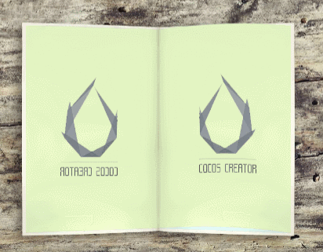


----
### 二、问题分析
书页在翻动的过程中会产生一定的弯曲形变，这就意味着在每一帧中，我们所看到的书页都具有不同的形状，如果使用序列帧动画来实现，就要对每一帧单独绘制一张图片，这样将产生大量的资源。如果能够通过代码来模拟，就可以避免资源问题。

所以，我们要解决的问题就变成了如何将原本的书页图片渲染成翻页过程中的弯曲状态呢？

我们先观察一下书页形变后的样子:

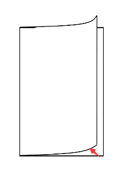

通过上面这张图，我们发现可以将书页的形变简化成这样：
> 1.把书页的底边想象成一根绳子，固定左边的位置不变，拉着右边向左上方位移形成一条曲线。
>
> 2.将整个书页沿着这条曲线向上位移

通过以上两个步骤，我们就可以模拟出书页在任何一个时刻的样子。不同时刻书页形态的区别实际上就是曲线的不同，只要能够获得任意时刻书页底边的那条曲线，就能模拟出翻页的效果。


----
### 三、解决方案
那么该如何获得那条曲线呢，这里提供两个方案。

#### 1、贝塞尔曲线
##### 1.1 背景介绍
贝塞尔曲线是应用于二维图形应用程序的数学曲线 ，通过至少3个控制点，就可以描述出一条曲线。N阶贝塞尔曲线拥有N+1个控制点。

以3阶贝塞尔曲线为例，它的具体公式如下：

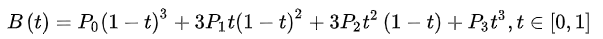

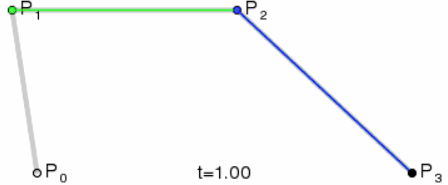

只要确定了起点P0，控制点P1，控制点P2和终点P3，就可以画出这样一条曲线，它将和P0P1、P2P3分别相切。

##### 1.2 实现
只要找到任意时刻4个控制点的位置，我们就可以把书页底边的曲线模拟出来。当然，起点的位置其实是固定不变的（除非你把书页从书上撕下来）。

如果以终点与起点连线和水平面的夹角来描述翻页过程中的某一个具体的位置，那么我们可以观察书页在每一个角度的曲线形状，然后把控制点的位置推导出来，从而还原整个翻书过程，但这样显然是无法实现的。

我们只能先确定部分特殊角度的控制点，然后在这些控制点间做插值。

**(1)** 选取几个特殊角度，获得控制点的位置，保证在这些特殊角度曲线的形状是较为真实的。

例如，在0°和180°时，我们获得的必然是一条直线，而在90°时，曲线大概是长这样：

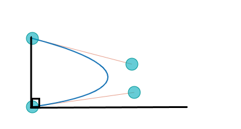

**(2)** 在特殊角度之间插值。

可以想象，均匀插值是不够真实的，以0°到90°为例，终点的运动轨迹应该是类似下图这样，x坐标的变换由慢到快，而y坐标的变换则是由快到慢。

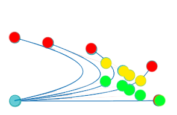

选取一个合适的插值函数，就可以模拟出一个还不错的翻页效果：

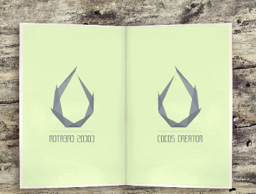

使用贝塞尔曲线来模拟的最大问题在于这种方法与真实的物理运动是没有关系的，它在某一个时刻的形状实际上是根据观察推测出的一个插值公式得到的。这就导致我们最终得到的曲线长度并不等于书页的宽度，所以在获得了曲线之后，我们还需要修正曲线长度与书页宽度一致，具体的实现会在后文提到。


#### 2、verlet积分算法
考虑到贝塞尔曲线的缺点，我们需要一种更加接近真实物理运动规律的方法，也就是第二种实现方案——verlet积分算法。

##### 2.1 背景知识
- 质点弹簧系统

模拟物体变形最简单的方法就是采用弹簧质点系统 。在质点弹簧系统中，我们需要定义一系列的质点，也就是有质量的点，并假设质点之间存在一个拥有一定长度、质量为0的弹簧。当质点运动时，会受到内力和外力和影响，内力包括弹簧的弹性力和阻尼力，外力包括重力以及空气阻力等。

模拟物体的运动，实际上就是计算出物体在任意时刻的位置。在质点弹簧系统中，我们可以获得每个质点受到的力以及它的质量，根据牛顿第二定律，我们就可以算出质点的加速度。有了加速度，再通过一定的算法，就可以计算质点的位置。

- 显式欧拉积分算法

显式欧拉积分是一种较为简单的算法。 在显式欧拉积分中，下一时刻的状态由当前时刻的状态决定。 显式欧拉积分的问题在于误差较大且不稳定，所以我们不予采用。

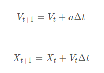

- verlet积分算法

verlet积分算法是一种基于位置的积分，通过质点在当前时刻和上一时刻的位置来计算出新的位置。verlet积分算法在精度和稳定性上都要优于显式欧拉积分算法，并且计算的复杂度相差不大。

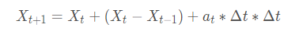

- 约束

假设质点间弹簧的弹力系数为无限大，那么当拉伸或压缩弹簧时，两个质点之间的距离总会保持在原来的长度。利用这种思想我们就可以通过增加质点间的距离约束来简化弹力的计算。

##### 2.2 实现
现在我们把书页底边看作是由一些水平放置的质点连接而成。当我们移动尾质点的位置时，其他质点将会由于质点间弹簧的约束作用而跟着移动。这样，我们就可以使用一种较为真实的方法来获得一条曲线。

使用verlet积分来计算曲线的方法如下：

**(1)** 首先根据书页的宽度来定义一系列水平放置的质点。
```
// 初始化质点
    public initPointList() {
        for(let i = 0; i < this.pointsCount; ++i) {
            let posX = i / (this.pointsCount - 1) * this.node.width
            this._pointList.push(new PagePoint(posX, 0))
        }
    }
```

**(2)** 在每一帧先根据verlet积分公式来更新每个质点的位置。

当前位置和上一个位置的差可以看作是质点的速度，由于空气阻力等造成的能量损耗，这里还需要额外乘上一个衰减系数。

​ 加速度的影响这里可以简化为一个竖直向下的重力。
```
// 使用verlet积分更新位置
    public simulate() {
        let gravity = cc.v2(0, this.gravity)
        for (let i = this.pointsCount - 1; i >= 1; i--) {
            let point = this._pointList[i]
            // 速度等于当前位置与上一个位置的差乘上衰减系数
            let velocity: cc.Vec2 = point.newPos.sub(point.oldPos).mul(this.damping)
            // 模拟一个水平放置的绳子，当y小于等于0时，将不再受重力影响
            if(point.newPos.y <= 0) {
                gravity.y = Math.max(0, gravity.y)
            }
            point.oldPos = point.newPos
            point.newPos = point.newPos.add(velocity)  
            point.newPos = point.newPos.add(gravity)
        }
    }
```

**(3)** 通过弹簧约束来修正质点的位置，修正的次数越多，效果也就越好，但同时带来的性能开销也就越大。
```
// 约束纠正
    public applyConstraint() {
        // 两个质点之间的固定距离
        let normalDistance = this.node.width / (this.pointsCount - 1)
        let endPos = this._getEndPos()
        for (let t = 0; t < this.constraintTimes; t++) {
            this._updateEndPos(endPos)
            //由最后一个质点开始依次纠正
            for (let i = this.pointsCount - 1; i >= 1; i--) {
                let firstPoint = this._pointList[i - 1]
                let secondPoint = this._pointList[i]
                let delatPos = secondPoint.newPos.sub(firstPoint.newPos)
                let distance = delatPos.mag()
                let fixDirection :cc.Vec2 = null
                if (distance < normalDistance) {
                    fixDirection = delatPos.normalize().negate()
                } else if (distance > normalDistance) {
                    fixDirection = delatPos.normalize()
                } else {
                    continue
                }

                let fixLen = Math.abs(distance - normalDistance)
                if (i == 1) {
                    // 由于第一个质点是固定的，所以只对第二个质点做纠正
                    let fixVector = fixDirection.mul(fixLen)
                    secondPoint.newPos.subSelf(fixVector)
                } else {
                    // 将两个质点之间的距离纠正为固定长度
                    let fixHalfVector = fixDirection.mul(fixLen * 0.5)
                    firstPoint.newPos.addSelf(fixHalfVector)
                    secondPoint.newPos.subSelf(fixHalfVector)
                }
            }
        }
    }
```

**(4)** 添加一个移动尾质点的方法

这里我们就使用和贝塞尔曲线相同的运动轨迹来做对比，可以看到使用verlet积分算法得到的结果要更加的真实。

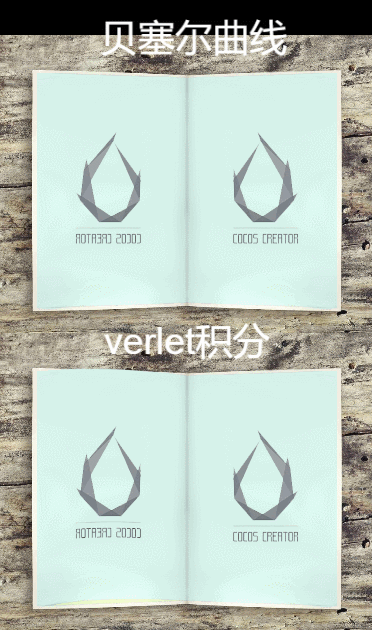

##### 2.3 参数对效果的影响
使用不同的参数值，会展现出不同的材质效果。影响verlet积分算法效果的参数主要有：速度衰减系数、重力和纠正次数。使用的时候需要通过调节参数来获得一个较为满意的效果。

- 速度衰减系数

速度当前位置与上一个位置的差计算得到，可以看作是惯性的一种近似表现。当运动停止时，各个质点还会由于惯性继续运动下去。速度衰减系数越大，惯性就越大，模拟出的书页就会晃动的比较厉害。

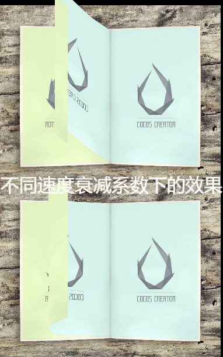

- 重力

重力会在每一帧将质点向下拉动一定距离，如果书页在水平方向运动的速度比较慢，就会表现出一种难以将书页拉起的感觉。

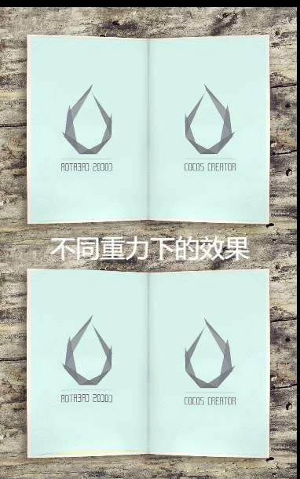

- 纠正次数

纠正的次数越多，每两个质点之间的距离也就越接近初始的固定值，所以纠正次数会影响书页的柔软度。需要注意的，纠正次数越多，也就意味着更多的计算量，使用时应该均衡考虑。


----
### 四、补充说明

#### 1、如何将书页纹理渲染成沿着曲线向上位移后的样子。
涉及到渲染问题，我们首先得看一下渲染管线是如何工作的。

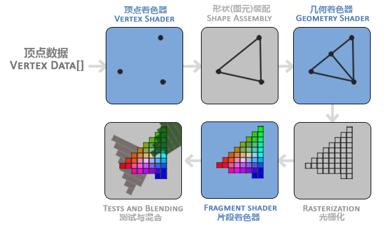

首先，顶点着色器会对我们传入的每个顶点进行处理，处理后的顶点将被组合成三角形，这些三角形经过光栅化会形成片段。最后，经过片段着色器的计算得到每个片段的颜色值。

简单来说，Sprite组件根据所在节点的宽、高、坐标、锚点等信息得到了由4个顶点围成的矩形，这个矩形最后显示到屏幕上时会变成许许多多个小的像素点，而每个像素点的颜色则是OpenGL根据片段的纹理坐标和Sprite使用的纹理采样得到的。

如果想要渲染出由曲线围成的书页图片，4个顶点显然是不够的。所以，我们需要自定义一个渲染组件来传入更多的顶点以完成需求：
- (1)将书页的上下边分成若干条线段来拟合曲线，也就是在原本矩形的上下边的两个端点之间创建更多的顶点。
- (2)连接上下边的顶点形成若干个三角形。

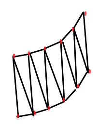

最终得到的图形可以看作是由若干个小的矩形拼接得到。显然顶点的数量越多，曲线也就越平滑。而经过前面的分析，每个顶点在任意时刻的坐标我们都可以轻易获得。使用贝塞尔曲线方法直接套用贝塞尔公式即可得到，而verlet积分方法中的质点则刚好与这里的顶点一一对应。

如果把顶点数调低的话，就可以比较明显的看出各个小矩形的范围：

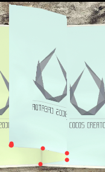

想要传入更多的顶点，就得自定义渲染组件和Assembler。Assembler 是指处理渲染组件顶点数据的一系列方法，每个渲染组件都拥有一个Assembler成员。 Assembler 中必须要定义 updateRenderData 及 fillBuffers 方法，前者需要更新准备顶点数据，后者则是将准备好的顶点数据填充进 VetexBuffer 和 IndiceBuffer 中 。
```
public updateRenderData (comp: any) {
      if (comp) {
          let pointList: cc.Vec2[] = comp.getPointList()
          let pointNum: number = pointList.length
          if (pointNum < 2) {
              return
          }

          let node = comp.node
          let height = node.height
          let width = node.width
          let posX = - width * node.anchorX
          let posY = - height * node.anchorY

          let gapU = 1 / (pointNum - 1)
          let lastU = 0
          let nextU = 0

          let floatsPerVert = this.floatsPerVert;
          let verts = this.renderData.vDatas[0];
          // 写verts时的下标
          let dstOffset = 0;
          for (let i = 1; i < pointNum; i++) {
              let lastPoint = pointList[i - 1]
              let nextPoint = pointList[i]
              nextU = lastU + gapU

              // 顶点和质点一一对应
              // 顶点数据写入verts
              dstOffset = floatsPerVert * (i-1) * 4;
              verts[dstOffset]     = posX + lastPoint.x;
              verts[dstOffset + 1] = posY + lastPoint.y;
              verts[dstOffset + 2] = lastU;
              verts[dstOffset + 3] = 1;
              dstOffset += floatsPerVert;

              verts[dstOffset]     = posX + nextPoint.x;
              verts[dstOffset + 1] = posY + nextPoint.y;
              verts[dstOffset + 2] = nextU;
              verts[dstOffset + 3] = 1;
              dstOffset += floatsPerVert;

              verts[dstOffset]     = posX + lastPoint.x;
              verts[dstOffset + 1] = posY + height + lastPoint.y;
              verts[dstOffset + 2] = lastU;
              verts[dstOffset + 3] = 0;
              dstOffset += floatsPerVert;

              verts[dstOffset]     = posX + nextPoint.x;
              verts[dstOffset + 1] = posY + height + nextPoint.y;
              verts[dstOffset + 2] = nextU;
              verts[dstOffset + 3] = 0;

              lastU = nextU
          }

          this.updateColor(comp, null);
          this.updateIsFront(comp, 5);
      }
  }
```

```
fillBuffers(comp, renderer) {
        let renderData = this.renderData;
        let vData = renderData.vDatas[0];
        let iData = renderData.iDatas[0];

        let buffer = this.getBuffer();
        let offsetInfo = buffer.request(this.verticesCount, this.indicesCount);

        let vertexOffset = offsetInfo.byteOffset >> 2,
            vbuf = buffer._vData;

        if (vData.length + vertexOffset > vbuf.length) {
            vbuf.set(vData.subarray(0, vbuf.length - vertexOffset), vertexOffset);
        } else {
            vbuf.set(vData, vertexOffset);
        }

        let ibuf = buffer._iData,
            indiceOffset = offsetInfo.indiceOffset,
            vertexId = offsetInfo.vertexOffset;
        for (let i = 0, l = iData.length; i < l; i++) {
            ibuf[indiceOffset++] = vertexId + iData[i];
        }
    }
```

#### 2.修正贝塞尔曲线的长度
如果不对贝塞尔曲线做修正的话，在翻动过程中书页就会被拉宽或缩短：

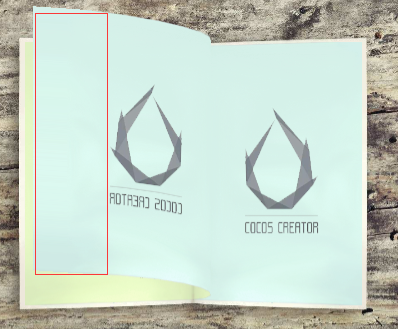

由于贝塞尔曲线是推测得出的，所以最后获得的曲线长度与实际书页宽度并不相等，修正的方法也很简单，累加当前得到的每两个顶点之间的距离（也就是小矩形的宽度），如果大于真实宽度，就进行衰减处理，在最后一个顶点处进行多减少补，从而使得所有小矩形宽度之后等于真实宽度。

```
  // 修正宽度
  private _fixWidth(lastBezierPos: cc.Vec2, nextBezierPos: cc.Vec2, width: number, realWidth: number, isTail: boolean) {
       let deltaVector = nextBezierPos.sub(lastBezierPos)
       // 两个顶点的间距
       let gapWidth = deltaVector.mag()
       // 当前的总长
       let curWidth = realWidth + gapWidth
       if(isTail) {
           // 如果是最后一个顶点则将总长度修正至书页的真实宽度
           gapWidth = width - realWidth
           let direction = deltaVector.normalize()
           nextBezierPos = lastBezierPos.add(direction.mul(gapWidth))
       } else if(curWidth >= width) {
           // 如果当前总长超过了书页的真实宽度，就衰减超过部分的1.1倍
           let delta = curWidth - width
           gapWidth = gapWidth - delta * 1.1
           gapWidth = Math.max(0, gapWidth)
           let direction = deltaVector.normalize()
           nextBezierPos = lastBezierPos.add(direction.mul(gapWidth))
       }

       return {
           gapWidth: gapWidth,
           nextBezierPos: nextBezierPos,
       }
   }
```

另一个需要注意的点是纹理坐标的计算，经过贝塞尔曲线公式计算后，顶点将不再是均匀分布，所以纹理坐标必须根据每个小矩形占总长度的比例来获得。如果使用等分来获得纹理坐标，效果将如下图所示：

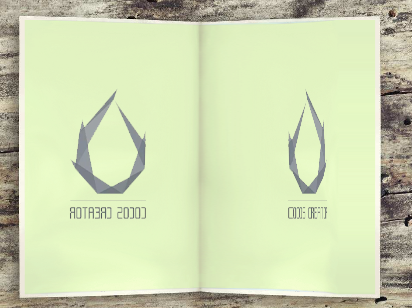

#### 3.背面纹理实现
在之前演示的效果图中可以看到，书页正反面的纹理是不一样的，这个是如何实现的呢？这里提供两种思路。

##### 3.1 背面剔除

通过设置背面剔除，OpenGL会根据节点的环绕顺序来识别正面和背面，并将所有背面的顶点都剔除掉，不参与最终的渲染。

只要使用两个节点来分别表示书页正面和背面，并一个剔除掉背面，一个剔除掉正面，即可拼出最终的图像。但还需要考虑到正面和背面的层级问题，在贝塞尔曲线的实现中，背面始终在正面的层级之上，但verlet积分算法实现的效果中就显然不是这样了，有时甚至会出现一个面穿插在另一个面中的情况：

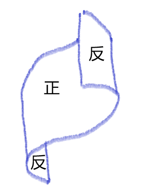

所以背面剔除的方法具有一定的局限性。

#### 3.2 自定义shader

另一种方法是创建一个自定义shader，传入两张纹理，并增加一个新的顶点属性来告诉片段着色器应该对哪一张纹理进行采样。

判断一个小矩形应该使用正面纹理还是反面纹理其实很简单，只要通过前后两个顶点的x坐标来判断就行，后一个顶点的x坐标大则为正。而由于后绘制的顶点本身就会覆盖前面的顶点，所以使用这种方法就不用考虑层级的问题了。
