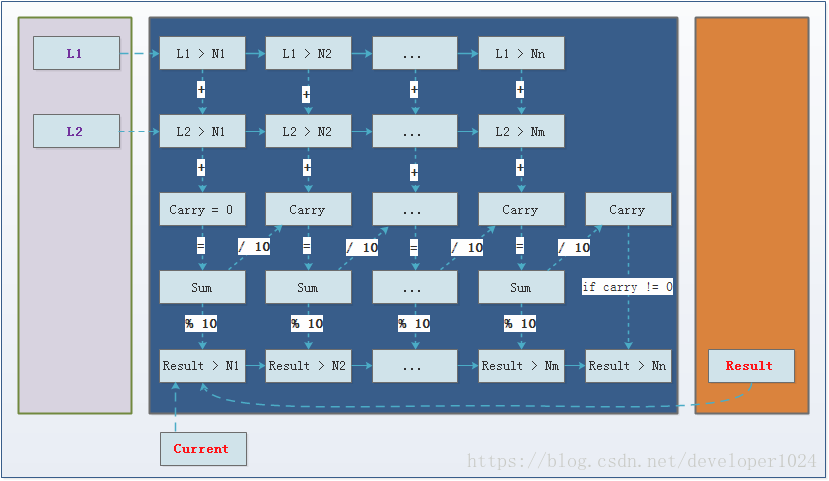

#### 一、题目

You are given two **non-empty** linked lists representing two non-negative integers. The digits are stored in reverse order and each of their nodes contain a single digit. Add the two numbers and return it as a linked list.

You may assume the two numbers do not contain any leading zero, except the number 0 itself.

> Input: (2 -> 4 -> 3) + (5 -> 6 -> 4)
>
> Output: 7 -> 0 -> 8


**题目翻译：**

给两个链表代表两个反向存储的数字，返回他们的和，用链表表示。

---

#### 二、解题方案
据原题的意思，我们想到的方法就是**从头到尾**的对L1和L2的每一个非空结点和**进位数carry**求和。再通过**取余**和**整除10**将carry的**个位数值赋给新链表node** = dummy，**十位数值更新到下一位的carry初始值**。当L1和L2都遍历完之后，如果carry不为0，就给node再增加一个值为carry的结点，即l1和l2求和的最高位。最后，将得到的和用取余运算从低位到高位采用尾插入法得到相同形式的链表。

解题思路图标说明 ：


##### 1. 递归法
技巧在于如何处理不同长度的数字，以及进位和最高位的判断。这里对于不同长度的数字，我们通过将较短的数字补0来保证每一位都能相加。

递归写法的思路比较直接，即判断该轮递归中两个ListNode是否为null。

- 全部为null时，返回进位值。
- 有一个为null时，返回不为null的那个ListNode和进位相加的值。
- 都不为null时，返回 两个ListNode和进位相加的值。

**代码实现：**

```
// Add Two Numbers(递归法-Java版本)
/**
 * Definition for singly-linked list.
 * public class ListNode {
 *     int val;
 *     ListNode next;
 *     ListNode(int x) { val = x; }
 * }
 */
public class Solution {

    public ListNode addTwoNumbers(ListNode l1, ListNode l2) {
        ListNode dummy = new ListNode(0);
        return addTwoNumbers(l1, l2, 0, dummy, dummy);
    }

    private ListNode addTwoNumbers(ListNode l1, ListNode l2, int carry, ListNode current, ListNode result) {
        if (l1 == null && l2 == null) {
            if (carry != 0) current.next = new ListNode(carry);
            return result.next;
        } else {
            l1 = (l1 == null) ? new ListNode(0) : l1;
            l2 = (l2 == null) ? new ListNode(0) : l2;
        }
        int sum = l1.val + l2.val + carry;
        carry = sum / 10;
        current.next = new ListNode(sum % 10);

        return addTwoNumbers(l1.next, l2.next, carry, current.next, result);
    }
}
```

##### 2. 迭代法
**思路：**

迭代法相比之下因为需要处理的分支较多，边界条件的组合比较复杂。过程同样是对齐相加，不足位补0。

迭代终止条件是两个ListNode都为null。

**注意：**
- 迭代方法操作链表的时候要记得手动更新链表的指针到next
- 迭代方法操作链表时可以使用一个dummy的头指针简化操作
- 不可以在其中一个链表结束后直接将另一个链表串接至结果中，因为可能产生连锁进位

**代码实现：**

```
// Add Two Numbers(迭代法-Java版本)
/**
 * Definition for singly-linked list.
 * public class ListNode {
 *     int val;
 *     ListNode next;
 *     ListNode(int x) { val = x; }
 * }
 */
public class Solution {
    public ListNode addTwoNumbers(ListNode l1, ListNode l2) {
        int carry = 0;
        int sum = 0;
        ListNode result = new ListNode(0);  // keep node list
        ListNode current = result;          // current pointer
        do {
            sum = (l1 != null ? l1.val : 0) + (l2 != null ? l2.val : 0) + carry;
            current.next = new ListNode(sum % 10);
            carry = sum / 10;
            l1 = l1 != null ? l1.next : null;
            l2 = l2 != null ? l2.next : null;
            current = current.next;
        } while (l1 != null || l2 != null);
        if (carry != 0) current.next = new ListNode(carry);

	   return result.next;
    }
}
```
